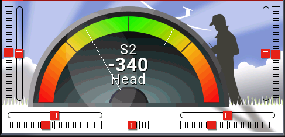

# OpenTx-Lua

Developed and testet with FrSky Horus X10S, Firmware 2.3.1

**SymGauge**

SymGauge [https://github.com/KingKnecht/OpenTx-Lua/tree/master/SymGauge_src/SymGauge] contains a symmetrical gauge widget:

Features:
  * Shows current input value
  * Shows current source (not available in small zones e.g. TopBar)
  * Shows active mode for left side, right side and middle position (not available in small zones e.g. TopBar)
  * Two sweet spots can be defined. Shown as small lines in the widget.
    * Due the limitation to five options of Lua widget scripts, the second sweet spot needs to be defined in code.
  
I have developed this gauge for my iGyro 3e where I can adjust the gain via slider. A negative value is activating heading mode
and a positive value is activating damping mode. Middle postion means the gyro is not active.
The sweet spots are to remember my favorite positions.

Installation:

Copy the folder *SymGauge/* (contains main.lua and all PNGs) to your *WIDGETS/* folder on your SD card.
